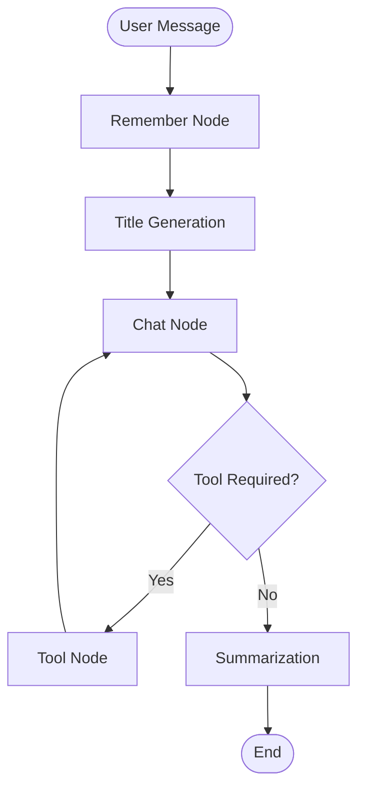
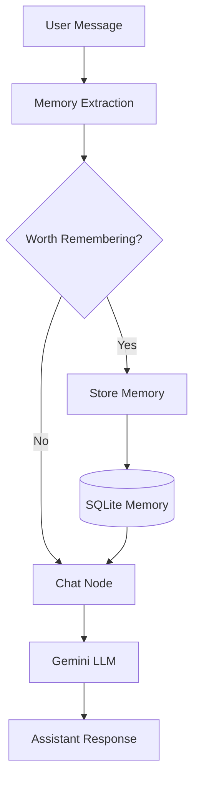
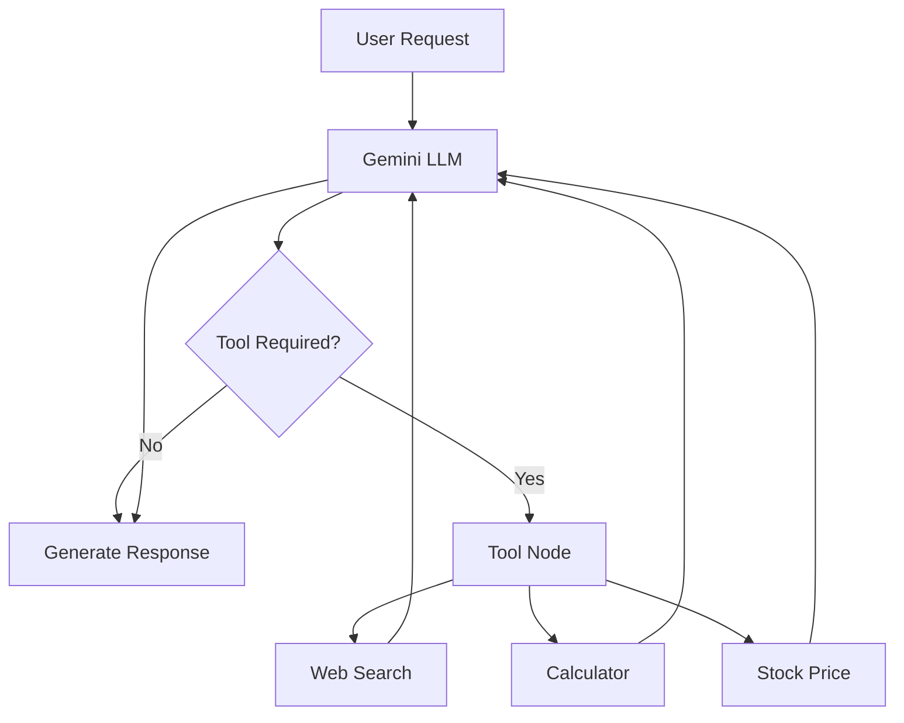

# 🧠 Memora

### A Stateful AI Assistant with Memory

> **Your AI assistant that remembers.**

Memora is a stateful conversational AI assistant built with **LangGraph** that goes beyond a traditional chatbot.

It maintains conversation context, remembers useful information about the user across conversations, dynamically uses external tools when required, persists conversations, automatically generates conversation titles, and summarizes long conversations to manage context efficiently.

<p align="center">

[](https://www.python.org/)
[](https://www.langchain.com/langgraph)
[](https://www.langchain.com/)
[](https://ai.google.dev/)
[](https://streamlit.io/)
[](LICENSE)

</p>


## 🎥 Demo

> 🚧 **Demo video coming soon**

A short walkthrough demonstrating Memora's conversational memory, tool calling, conversation management, and stateful workflow will be added here.

<!--
Add your demo GIF/video here:


Or add a YouTube/demo link:

[▶️ Watch the Demo](YOUR_VIDEO_URL)
-->


# ✨ What is Memora?

Most basic LLM applications work like this:

```text
User → LLM → Response
```

Memora takes a more stateful approach:

```text
User
  ↓
Stateful AI Workflow
  ↓
Memory + LLM + Tools
  ↓
Persistent State
  ↓
Context-aware Response
```

The goal is to build an AI assistant that can **remember, reason, use tools, and maintain context** rather than treating every message as an isolated request.


# 🎯 Why I Built This

Building a chatbot with an LLM API is relatively straightforward but building a chatbot that behaves more like a useful assistant introduces several engineering challenges:

* How should conversation state be maintained?
* How can multiple conversations exist independently?
* How can useful information about a user be remembered?
* How should the assistant decide when it needs an external tool?
* What happens when a conversation becomes very long?
* How can state survive application restarts?
* How can conversations be organized and revisited easily?

Memora was built as a hands-on exploration of these problems using **LangGraph and modern LLM application patterns**.


# 🚀 Key Features

## 🧠 Long-Term User Memory

Memora can identify information from a user's messages that may be useful in future conversations.

For example:

```text
User:
"I am currently working on an MCP server using Python."

             ↓

Memory Extraction

             ↓

Stored User Memory:
"User is working on a Python-based MCP server."
```

When the user interacts with the memora again, the stored information can be provided to the LLM so that responses can be personalized.

The memory extraction process uses structured LLM output to determine:

* Whether a message contains memory-worthy information
* What information should be stored
* Whether the information is new or already known

Only information explicitly provided by the user is considered for storage; the memory prompt instructs the model not to speculate.


## 💬 Stateful Conversations

Memora maintains state for each conversation using a unique conversation/thread ID.

This allows multiple conversations to exist independently:

```text
Conversation A
    ├── Message 1
    ├── Message 2
    └── Message 3

Conversation B
    ├── Message 1
    └── Message 2

Conversation C
    ├── Message 1
    ├── Message 2
    └── Message 3
```

Each conversation can be reopened from the application's sidebar.


## 💾 Persistent State

LangGraph's `SqliteSaver` is used as the checkpoint backend.

This allows LangGraph workflow state to be persisted rather than existing only in application memory.

The application also maintains SQLite tables for:

* Conversations
* Messages
* Long-term user memory

This gives the application a lightweight persistent storage layer suitable for local development and experimentation.


## 🛠️ Tool Calling

Memora is not restricted to information contained within the language model.

The LLM can determine when an external tool is required and LangGraph routes execution to the appropriate tool.

Currently available tools include:

### 🔎 Web Search

Uses DuckDuckGo search to retrieve information from the web.

Example:

```text
User:
"What are the latest developments in LangGraph?"

              ↓

LLM decides web search is required

              ↓

DuckDuckGo Search

              ↓

Search results returned to LLM

              ↓

Final response
```

### 🧮 Calculator

Supports basic arithmetic operations:

* Addition
* Subtraction
* Multiplication
* Division

### 📈 Stock Price

Retrieves stock information using the Alpha Vantage API.

Example:

```text
User:
"What is the current price of AAPL?"

              ↓

LLM
 ↓
Stock Price Tool
 ↓
Alpha Vantage
 ↓
LLM
 ↓
Response
```


## 📝 Automatic Conversation Titles

Creating multiple conversations can quickly become difficult to manage if every conversation is simply named something like:

```text
Chat 8f3a91c2
Chat 2a91bc71
Chat 72fa01de
```

This application automatically generates a concise title from the first user message.

For example:

```text
User:
"Help me prepare my resume for a Google
Software Engineer role."

        ↓

Generated title:

"Google SWE Resume Review"
```

The generated title is then displayed in the conversation sidebar.

This makes the application easier to navigate as the number of conversations grows.


## 🗜️ Conversation Summarization

Long conversations create a challenge for LLM applications because continuously sending the entire conversation history can increase context size and token usage.

Memora addresses this through **automatic conversation summarization**.

When the conversation exceeds the configured message threshold:

```text
More than 20 messages
        ↓
Generate conversation summary
        ↓
Keep recent messages
        ↓
Remove older messages
        ↓
Continue conversation
```

The current implementation keeps the latest **10 messages** while storing a summary of the earlier conversation.

This allows memora to retain the important context of a long conversation without continually carrying the entire raw history forward.


## ⚡ Streaming Responses

The frontend streams assistant responses from the LangGraph execution rather than waiting for the entire response to finish.

Conceptually:

```text
LLM generates response
        ↓
Response chunks
        ↓
Streamlit
        ↓
User sees response progressively
```

This improves the perceived responsiveness of the application.


# 🏗️ System Architecture

At a high level, Memora consists of:

1. **Streamlit Frontend** — User-facing chat interface
2. **LangGraph Workflow** — Orchestrates the AI workflow
3. **Gemini LLM** — Provides language understanding and generation
4. **External Tools** — Extend the assistant's capabilities
5. **SQLite** — Provides persistence for state, conversations, messages, and long-term memory

```text
                         ┌──────────────────┐
                         │       USER       │
                         └────────┬─────────┘
                                  │
                                  ▼
                    ┌─────────────────────────┐
                    │    STREAMLIT FRONTEND   │
                    │                         │
                    │  • Chat Interface       │
                    │  • Conversations        │
                    │  • Streaming Responses   │
                    └────────────┬────────────┘
                                 │
                                 ▼
                    ┌─────────────────────────┐
                    │      LANGGRAPH          │
                    │     STATEFUL WORKFLOW   │
                    └────────────┬────────────┘
                                 │
             ┌───────────────────┼──────────────────┐
             │                   │                  │
             ▼                   ▼                  ▼
      ┌─────────────┐     ┌─────────────┐    ┌─────────────┐
      │   Memory    │     │     Chat    │    │ Summarizer  │
      │    Node     │     │     Node    │    │             │
      └──────┬──────┘     └──────┬──────┘    └─────────────┘
             │                   │
             ▼                   ▼
      ┌─────────────┐     ┌─────────────┐
      │ Long-Term   │     │ Gemini LLM  │
      │ Memory      │     └──────┬──────┘
      └─────────────┘            │
                                 ▼
                          ┌─────────────┐
                          │  Tool Node  │
                          └──────┬──────┘
                                 │
                   ┌─────────────┼─────────────┐
                   ▼             ▼             ▼
                Search       Calculator      Stocks
                   │             │             │
                   └─────────────┼─────────────┘
                                 │
                                 ▼
                            Gemini LLM
                                 │
                                 ▼
                              Response

                                 │
                                 ▼
                           ┌────────────┐
                           │   SQLite   │
                           │            │
                           │ Checkpoints│
                           │ Conversations
                           │ Messages   │
                           │ Memory     │
                           └────────────┘
```


# 🔄 LangGraph Workflow

The core chatbot logic is implemented as a **state graph**.

Each node represents an operation, while edges determine how execution moves through the workflow.



### Workflow Components

| Node                    | Responsibility                                                       |
| -- | -- |
| 🧠 **Remember Node**    | Identifies useful information that may be stored as long-term memory |
| 📝 **Title Generation** | Generates a concise title for a new conversation                     |
| 💬 **Chat Node**        | Interacts with the Gemini LLM using conversation and memory context  |
| 🛠️ **Tool Node**       | Executes tools requested by the LLM                                  |
| 🗜️ **Summarization**   | Compresses older conversation history                                |
| 💾 **Checkpoint**       | Persists LangGraph execution state                                   |


# 🧠 Memory Architecture

Memora separates **conversation state** from **long-term user memory**.

This distinction is important.

### Conversation State

Answers:

> **"What are we currently talking about?"**

### Long-Term Memory

Answers:

> **"What useful information do I know about this user?"**



### Example

```text
Conversation 1

User:
"I'm preparing for an AI Engineer interview."

                ↓

Memory System

                ↓

Stored Memory:
"User is preparing for an AI Engineer interview."

                ↓

Conversation ends


Conversation 2

User:
"What should I focus on this week?"

                ↓

Retrieve relevant memory

                ↓

LLM receives user context

                ↓

Personalized response
```


# 💾 Persistence Architecture

SQLite is used for several different persistence requirements.

```text
                         SQLite
                            │
          ┌─────────────────┼─────────────────┐
          │                 │                 │
          ▼                 ▼                 ▼
   ┌─────────────┐   ┌─────────────┐   ┌─────────────┐
   │ Checkpoints │   │Conversations│   │   Messages  │
   │             │   │             │   │             │
   │ LangGraph   │   │ Conversation│   │ User + AI   │
   │ workflow    │   │ metadata    │   │ messages    │
   │ state       │   │ and titles  │   │             │
   └─────────────┘   └─────────────┘   └─────────────┘
                                             │
                                             │
                                             ▼
                                      ┌─────────────┐
                                      │ Long-Term   │
                                      │ Memory      │
                                      │             │
                                      │ User facts  │
                                      └─────────────┘
```

LangGraph checkpoint persistence is handled using `SqliteSaver`, while application-level conversation and memory data are stored separately.

The custom long-term memory layer uses a namespace-based structure containing information such as:

```text
namespace
key
value
created_at
updated_at
```

This provides a simple foundation for organizing user-specific memories.


# 🛠️ Tool Calling Architecture

Memora uses an LLM-driven tool selection flow.



The important design principle is:

> **The application does not execute every tool for every request. The LLM determines when an external capability is required.**


# 🗜️ Context Management

As conversations grow, sending the complete raw message history to the LLM becomes increasingly expensive.

Memora therefore uses conversation summarization.

```text
┌───────────────────────────────────────────┐
│              Conversation                 │
│                                           │
│ M1 M2 M3 M4 M5 M6 ... M20 M21 M22 ...    │
└──────────────────────┬────────────────────┘
                       │
                       ▼
                Threshold reached
                       │
                       ▼
              ┌─────────────────┐
              │ Generate Summary│
              └────────┬────────┘
                       │
             ┌─────────┴──────────┐
             ▼                    ▼
       Older Messages        Recent Messages
         → Summary              → Kept
             │                    │
             └──────────┬─────────┘
                        ▼
                  Continue Chat
```

This pattern helps control context growth while retaining important conversational information.


# 🔄 End-to-End Request Flow

For a request such as:

> **"What are the latest developments in LangGraph?"**

the system follows this general flow:

```text
1. User enters a message
          ↓
2. Streamlit receives the message
          ↓
3. Conversation state is identified
          ↓
4. Memory node checks for useful user information
          ↓
5. Title generation runs when required
          ↓
6. Chat node sends context + memory to Gemini
          ↓
7. Gemini determines that web search is required
          ↓
8. LangGraph routes execution to the tool node
          ↓
9. Web search executes
          ↓
10. Search results are returned to Gemini
          ↓
11. Gemini generates the final response
          ↓
12. Conversation state is updated
          ↓
13. Summarization runs when the threshold is reached
          ↓
14. Response is streamed to the user
```


# 💡 Key Engineering Decisions

## Why LangGraph?

A simple LLM application could be implemented as:

```python
response = llm.invoke(messages)
```

However, Memora requires multiple coordinated operations:

```text
Memory
  ↓
Title Generation
  ↓
Chat
  ↓
Tool Decision
  ↓
Tool Execution
  ↓
Chat
  ↓
Summarization
```

LangGraph provides an explicit stateful workflow for representing these operations.

This enables:

* Explicit workflow states
* Conditional routing
* Cyclic execution
* State management
* Checkpoint persistence
* Modular workflow design


## Why Separate Long-Term Memory from Conversation History?

Conversation history and long-term memory have different purposes.

Keeping them separate makes it possible to:

* Manage conversation context independently
* Persist user information beyond a conversation
* Avoid treating every chat message as permanent memory
* Evolve the memory system independently from conversation storage


## Why Structured Memory Extraction?

Rather than blindly saving user messages, the memory workflow uses structured LLM output to determine whether information should be stored.

Conceptually:

```text
MemoryDecision
│
├── should_write
│
└── memories[]
       │
       ├── text
       └── is_new
```

This provides a more controlled approach to long-term memory.


## Why SQLite?

SQLite provides a lightweight persistence layer without requiring an external database server.

For a local development and portfolio application, it provides a simple way to persist:

* LangGraph checkpoints
* Conversations
* Messages
* Long-term memory

The persistence layer can later be migrated to a production database such as PostgreSQL.


# 🛠️ Technology Stack

| Technology        | Purpose                                      |
| -- | -- |
| **Python**        | Core application and workflow implementation |
| **LangGraph**     | Stateful AI workflow orchestration           |
| **LangChain**     | LLM and tool integration                     |
| **Google Gemini** | Language model                               |
| **Streamlit**     | Interactive frontend                         |
| **SQLite**        | Persistent storage                           |
| **DuckDuckGo**    | Web search                                   |
| **Alpha Vantage** | Stock information                            |
| **Pydantic**      | Structured data validation                   |
| **python-dotenv** | Environment configuration                    |


# 📁 Project Structure

```text
memora-ai/
│
├── langgraph_backend.py
│   ├── LangGraph workflow
│   ├── LLM configuration
│   ├── Tool definitions
│   ├── Memory system
│   ├── Conversation persistence
│   ├── Summarization
│   └── Title generation
│
├── streamlit_frontend.py
│   ├── Chat interface
│   ├── Conversation sidebar
│   ├── Conversation switching
│   └── Streaming responses
│
├── prompts.py
│   ├── System prompt
│   └── Memory extraction prompt
│
├── test_memory_db.py
│   └── Memory database tests
│
├── cleanup.py
│   └── Cleanup utilities
│
├── requirements.txt
│
├── LICENSE
│
└── README.md
```


# ⚙️ Getting Started

## Prerequisites

Make sure you have:

* Python 3.10+
* A Google Gemini API key
* An Alpha Vantage API key for stock functionality
* Internet access for web search and external APIs


## 1. Clone the repository

```bash
git clone https://github.com/Maaiz-Shaikh/memora-ai.git

cd memora-ai
```


## 2. Create a virtual environment

### Linux / macOS

```bash
python -m venv venv

source venv/bin/activate
```

### Windows

```bash
python -m venv venv

venv\Scripts\activate
```


## 3. Install dependencies

```bash
pip install -r requirements.txt
```


## 4. Configure environment variables

Create a `.env` file in the project root:

```env
GEMINI_API_KEY=your_gemini_api_key
ALPHA_VANTAGE_API_KEY=your_alpha_vantage_api_key
```

> ⚠️ Never commit your `.env` file or API keys to GitHub.


## 5. Run Memora

```bash
streamlit run streamlit_frontend.py
```

Streamlit will provide a local URL where you can access the application.


# 🧪 Testing

The project includes tests for the memory database.

Run:

```bash
python test_memory_db.py
```

As the project evolves, additional tests can be added for:

* Memory extraction
* Tool routing
* Graph transitions
* Conversation persistence
* Summarization
* Title generation


# 🔐 Security Considerations

Memora currently uses environment variables for API credentials.

For a production deployment, additional security measures would be required, including:

* Authentication
* Authorization
* Per-user memory isolation
* Secret management
* API rate limiting
* Input validation
* Database access controls
* Error monitoring
* Audit logging

The current project should therefore be considered a **portfolio/learning project with production-oriented architecture**, rather than a production-ready SaaS application.


# 📊 Engineering Highlights

This project demonstrates practical experience with several modern AI application patterns:

* **Stateful LLM workflows**
* **LangGraph orchestration**
* **Long-term memory**
* **Tool-augmented LLMs**
* **Conditional workflow execution**
* **Persistent checkpoints**
* **Conversation persistence**
* **Context-window management**
* **Conversation summarization**
* **Structured LLM output**
* **Streaming responses**
* **External API integration**
* **LLM-powered UX features**


# 🔮 Roadmap

Potential future improvements include:

* [ ] PostgreSQL-based production persistence
* [ ] User authentication and authorization
* [ ] Multi-user memory isolation
* [ ] Semantic memory retrieval using embeddings
* [ ] Improved memory ranking and retrieval
* [ ] Additional tools
* [ ] More complex agentic workflows
* [ ] Observability and tracing
* [ ] Automated response evaluation
* [ ] Token and cost monitoring
* [ ] Improved error handling and retries
* [ ] Docker-based deployment
* [ ] Production deployment
* [ ] Memory management interface
* [ ] Expanded unit and integration testing


# 📌 Project Status

🚧 **Active Learning & Experimentation Project**

The core conversational workflow, persistent conversations, long-term memory, tool calling, conversation summarization, automatic titles, and streaming interface are implemented.

The architecture is designed to evolve as additional AI capabilities and production infrastructure are explored.


# 📄 License

This project is licensed under the **MIT License**.

See the [LICENSE](LICENSE) file for details.


# 👨‍💻 Author

## Maaiz Shaikh

Software Engineer focused on **Generative AI, AI/ML Engineering, Agentic AI, RAG, and backend systems**.

* GitHub: [@Maaiz-Shaikh](https://github.com/Maaiz-Shaikh)
* LinkedIn: [Maaiz Shaikh](https://www.linkedin.com/)


<p align="center">

### 🧠 Memora

**An AI assistant that remembers.**

⭐ Explore the repository and experiment with the architecture.

</p>
